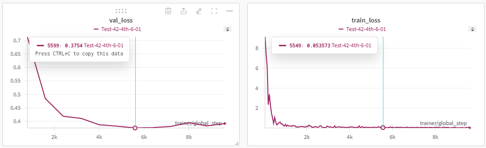

# 한국어 텍스트 요약 인공지능 모델 제작

## 프로젝트 개요
- 현대사회는 정보 과잉 시대이다. 수많은 정보의 홍수 속에서 자신에게 필요한 정보만 골라내는 일은 점점더 어려워지고 있다. 게다가 쇼츠나 릴스처럼 짧은 컨텐츠들이 유행하면서, 인내심을 갖고 긴 글에서 필요한 정보를 찾아내는 일이 더욱 힘들어졌다. 혹자는 충분한 시간을 들여서 긴 글을 직접 전부 읽어볼 수도 있겠지만, 대부분의 사람들은 가능하다면 짧게 요약된 글을 더 선호할 것이다. 그래서 긴 글을 짧게 요약해줄 수 있는 KoBART 기반의 한국어 텍스트 요약 모델을 조정하는 프로젝트를 진행해보았다.

## 프로젝트 진행
- 개인

## 프로젝트 기간
- 2024.10.14. ~ 2024.11.28.
    - 1주차 - 프로젝트 주제 선정
    - 2주차 - 데이터 전처리
    - 3주차 - 모델 학습을 위한 사전 준비
    - 4주차 - 모델 학습 진행
    - 5주차 - 모델 학습 진행(정규화 추가)
    - 6주차 - 모델 성능 평가
    - 7주차 - 코드와 결과 정리

## 라이브러리
- Python 3.8.20 ver.
- Pandas 2.0.3 ver.
- torch 2.4.1 ver.
- tokenizers 0.13.3 ver.
- Kobart 0.5.1 ver.
- Konlpy 0.6.0 ver.
- lightning 2.0.8 ver.
- Streamlit 1.26.0 ver.
- WanDB 0.15.9 ver.

## 목차
1. [사전 준비](#1-사전-준비)
2. [데이터 전처리](#2-데이터-전처리)
3. [모델 훈련](#3-모델-훈련)
4. [성능 평가](#4-성능-평가)

## 1. 사전 준비

### **_로컬 Anaconda Prompt에서 실행_**

---

### 아나콘다 가상환경 설정

- 파이썬 버전을 별도로 설정하기 위해, 아나콘다 가상환경을 생성해주었다.


```python
conda create -n pro2410 python=3.8
conda env list
conda activate pro2410
```

### KoBART 모델 클론

- 현재 위치(경로)에 대한 코드는 생략한다.

```python
git clone https://github.com/seujung/KoBART-summarization.git
```

### 패키지 및 라이브러리 설치


```python
# 패키지 설치
pip install git+https://github.com/SKT-AI/KoBART#egg=kobart
```


```python
# 라이브러리 설치
pip install -r requirements.txt
```


```python
# 로컬에 장착된 GPU의 기종과 Pytorch, CUDA, cuDNN 버전을 체크한 후 맞춰줘야 함
pip3 install torch torchvision torchaudio --index-url https://download.pytorch.org/whl/cu124
# CUDA와 cuDNN은 윈도우 환경에서 별도 설치
```

## 클론한 KoBART 모델의 오류 수정

### dataset.py

- \_\_getitem__ 함수의 return 부분을 torch.tensor 형태로 감싸주었다.


```python
# Original
        return {
                'input_ids': np.array(input_ids, dtype=np.int_),
                'decoder_input_ids': np.array(dec_input_ids, dtype=np.int_),
                'labels': np.array(label_ids, dtype=np.int_)
               }

# Modified
        return {
            'input_ids': self.to_tensor(input_ids).clone().detach().long(),
            'decoder_input_ids': self.to_tensor(dec_input_ids).clone().detach().long(),
            'labels': self.to_tensor(label_ids).clone().detach().long()
        }

    def to_tensor(self, data):
        if isinstance(data, torch.Tensor):
            return data
        else:
            return torch.tensor(data)
```

### train.py

- add_model_specific_args 함수에서, --train_file의 기본값을 data/train.tsv로 수정해주었다.


```python
# Original
        parser.add_argument('--train_file',
                            type=str,
                            default='data/test.tsv',
                            help='train file')

# Modified
        parser.add_argument('--train_file',
                            type=str,
                            default='data/train.tsv',
                            help='train file')
```

## WanDB 로그인

- 이후 프로젝트를 생성해준 뒤, 모델 훈련 결과를 그래프를 볼 수 있도록 설정해주었다.

## 주피터 노트북 실행

- 대부분의 작업을 주피터 노트북으로 진행했다.

- 트레이닝의 경우, 원인을 알 수 없는 출력 오류가 발생하여 아나콘다 프롬프트로 진행했다.


```python
jupyter notebook
```


## 2. 데이터 전처리

### AI Hub의 데이터 다운로드

- AI Hub에서 제공하는 '요약문 및 레포트 생성 데이터'를 사용했다.

- 출처 : https://aihub.or.kr/aihubdata/data/view.do?currMenu=115&topMenu=100&aihubDataSe=realm&dataSetSn=582

### 데이터 선정 및 가공

- 여러 데이터 중 데이터의 양을 고려하여, 훈련 데이터로 '역사_문화재' 종류를 선정했다.

- 추출 방식은 로컬 기기의 성능과 데이터의 양을 고려하여, 2~3문장 추출 방식으로 선정했다.

- 검증 데이터로는 훈련 데이터의 절반 정도의 양인 '간행물' 종류로 선정했다.

- 선정한 데이터를 압축 해제하여 json 파일 몇 개를 무작위로 검수했다.

- json 파일들을 csv 파일에 전부 합친 후, 클론한 KoBART에서 별다른 수정 없이 쓸 수 있도록 'type', 'id', 'passage', 'summary' 4개의 열만 남겨두었다.


## 3. 모델 훈련

### **_Jupyter Notebook에서 진행_**

---

### Import

- 필요한 패키지를 한 번에 import한다.


```python
import os
import sys
import io
import pandas as pd
import shutil
import torch
import wandb
from transformers import PreTrainedTokenizerFast, BartForConditionalGeneration
```

### 작업 위치 변경


```python
os.chdir('C:/StudyCoding/Project/KoBART-summarization')
print("현재 디렉토리:", os.getcwd())
```

### Training Data 설정

- csv 파일을 tsv로 변환


```python
path = 'C:/StudyCoding/Project_Text_Summary/TrainingPassages_his-cul.csv'
df = pd.read_csv(path, sep = ",", engine='python', encoding = "utf-8")
df.dropna(axis=0)
df.to_csv('train.tsv', sep='\t', encoding="utf-8", index=False)
```

- 각 파일 경로 설정


```python
source_file = 'C:/StudyCoding/Project/KoBART-summarization/train.tsv'
destination_folder = 'C:/StudyCoding/Project/KoBART-summarization/data/'
destination_file = 'C:/StudyCoding/Project/KoBART-summarization/data/train.tsv'
```

- 기존 파일이 있으면 삭제


```python
if os.path.exists(destination_file):
    os.remove(destination_file)
```

- 파일 이동


```python
shutil.move(source_file, destination_folder)
```

### Test Data 설정

- csv 파일을 tsv로 변환


```python
path = 'C:/StudyCoding/Project_Text_Summary/TestPassages_public.csv'
df = pd.read_csv(path, sep = ",", engine='python', encoding="utf-8")
df.dropna(axis=0)
df.to_csv('test.tsv', sep='\t', encoding="utf-8", index=False)
```

- 각 파일 경로 설정


```python
source_file = 'C:/StudyCoding/Project/KoBART-summarization/test.tsv'
destination_folder = 'C:/StudyCoding/Project/KoBART-summarization/data/'
destination_file = 'C:/StudyCoding/Project/KoBART-summarization/data/test.tsv'
```

- 기존 파일이 있으면 삭제


```python
if os.path.exists(destination_file):
    os.remove(destination_file)
```

- 파일 이동


```python
shutil.move(source_file, destination_folder)
```

### WanDB 로그인


```python
wandb.login()
```

### 모델 평가할 때 사용할 패키지 설치


```python
git clone https://github.com/SOMJANG/Mecab-ko-for-Google-Colab.git
cd Mecab-ko-for-Google-Colab
bash install_mecab-ko_on_colab_light_220429.sh
cd ..
```

---

### **_로컬 Anaconda Prompt에서 실행_**

---

- Jupyter Notebook과 Local Runtime에 연결한 Colab 모두 Training 중 Log가 정상적으로 출력되지 않는 현상이 있어서, 로컬 Prompt로 진행했다.

- Jupyter Notebook이 실행 중인 상태에서 새로 Prompt를 열어 진행했다.

### 파이썬 환경변수 설정 (cp949 인코딩 문제 해결)


```python
Python
import sys
sys.stdout = io.TextIOWrapper(sys.stdout.buffer, encoding='utf-8')
```

### Training

- 훈련 진행 중 별도로 설정이 필요한 옵션이 있다면 train.py를 참조하여 추가해준다.

```python
python train.py --max_epochs 50 --accelerator gpu --batch_size 5 --num_workers 4
```

### 과적합(OverFitting) 제한

- 훈련을 진행하면서 과적합 현상이 자주 발생하여, 이를 막기 위해 정규화(Regularization)를 적용하였다.
- 기존 모델에 가중치 감쇠(Weight Decay)가 적용되어있는 상태였다.

1. 조기 중단 (Early Stopping)
2. 드롭 아웃 (Drop-out)
3. 하이퍼파라미터 조정 (Hyperparameter)

#### 조기 중단 (Early Stopping) 코드 추가

- train.py에 추가했다.


```python
from lightning.pytorch.callbacks import EarlyStopping

if __name__ == '__main__':
    early_stopping_callback = EarlyStopping(
        monitor='val_loss',
        patience=5,
        verbose=True,
        mode='min'
    )

    trainer = L.Trainer(
        max_epochs=args.max_epochs,
        accelerator=args.accelerator,
        devices=args.num_gpus,
        gradient_clip_val=args.gradient_clip_val,
        callbacks=[checkpoint_callback, early_stopping_callback],
        logger=wandb_logger
    )
```

#### 드롭 아웃 (Drop-out) 코드 추가

- model.py에 추가했다.


```python
import torch.nn as nn

class KoBARTConditionalGeneration(L.LightningModule):
    def __init__(
        self,
        hparams,
        **kwargs):

        self.dropout = nn.Dropout(p=0.3)

    def forward(self, inputs):

        outputs = self.model(input_ids=inputs['input_ids'],
                             attention_mask=attention_mask,
                             decoder_input_ids=inputs['decoder_input_ids'],
                             decoder_attention_mask=decoder_attention_mask,
                             labels=inputs['labels'], return_dict=True)
        
        logits = self.dropout(outputs.logits)

        return {'ligits': logits,
                'loss': outputs.loss}
```

#### 하이퍼파라미터 조정 (Hyperparameter)

- 조정한 값은 다음과 같다.
    - 배치 크기 (Batch Size)
    - 드롭 아웃 (Drop-out)
    - 조기 중단 (Early Stopping)
    - 학습률 (Learning Rate)
    - 가중치 감쇠 (Weight Decay)

- 여러 번에 걸쳐 다양한 방식으로 값을 수정하며, 적당한 값을 찾았다. 최종적인 값은 다음과 같다.
    - 배치 크기 (Batch Size) : 5
    - 드롭 아웃 (Drop-out) : 0.3
    - 조기 중단 (Early Stopping) : 5
    - 학습률 (Learning Rate) : 2e-6
    - 가중치 감쇠 (Weight Decay) : 0.004



## 4. 성능 평가

### **_Jupyter Notebook에서 진행_**

---

### 모델 바이너리 추출


```python
python get_model_binary.py --model_binary 'checkpoint/epoch=06-val_loss=0.375.ckpt'
```

### KoBART 모델 및 토크나이저 로드


```python
model_binary_path = 'C:/StudyCoding/Project/KoBART-summarization-main/binary'
tokenizer = PreTrainedTokenizerFast.from_pretrained("gogamza/kobart-base-v1")
model = BartForConditionalGeneration.from_pretrained(model_binary_path)
```

### 요약할 텍스트 입력


```python
input_text =  """
대방광불화엄경은 줄여서 ‘화엄경’이라고 부르기도 하며, 부처와 중생이 둘이 아니라 하나라는 것을 기본사상으로 하고 있다. 화엄종의 근본경전으로 법화경과 함께 한국 불교사상 확립에 크게 영향을 끼친 경전이다.  이 책은 동진의 불타발타라가 번역한『화엄경』진본 60권 중 제13권으로 검푸른 종이에 금·은가루를 사용하여 글씨를 썼으며, 두루마리처럼 둘둘 말아서 보관할 수 있는 형태이다. 화려한 꽃무늬로 장식한 표지에는 경의 이름이 금색으로 쓰여 있으며, 그 아래의 원형 속에는 진본임을 표시하는 ‘진(晋)’자가 역시 금색으로 쓰여 있다. 권의 끝부분에 주지 향여(向如)가 보충하여 썼다는 기록이 있어서, 해인사 주지를 지냈던 체원(體元)이 쓴 것으로 여겨진다. 해인사에 보관되어 있는 체원이 쓴 목판을 통해 향여는 그의 호이며, 그는 고려 충숙왕대 스님임을 확인할 수 있다. 이 경전은 해인사에 있는 목판의 간행연도와 경전의 격식 등을 종합해 볼 때 1330년경에 쓰여진 것으로 추정된다.
"""
```

### 요약 출력


```python
input_ids = tokenizer.encode(input_text, return_tensors="pt", max_length=1024, truncation=True)

summary_ids = model.generate(input_ids, max_length=150, min_length=40, length_penalty=2.0, num_beams=4, early_stopping=True)

summary_text = tokenizer.decode(summary_ids[0], skip_special_tokens=True)

print("요약 텍스트:", summary_text)
```

- 요약 텍스트: 이 책은 동진의 불타발타라가 번역한『화엄경』진본 60권 중 제13권으로 검푸른 종이에 금·은가루를 사용하여 글씨를 썼으며, 두루마리처럼 둘둘 말아서 보관할 수 있는 형태이다. 화려한 꽃무늬로 장식한 표지에는 경의 이름이 금색으로 쓰여 있으며, 그 아래의 원형 속에는 진본임을 표시하는 ‘진(晋)’자가 역시 금색으로 쓰여 있다. 화엄종의 근본경전으로 법화경과 함께 한국 불교사상 확립에 크게 영향을 끼친 경전이다.

### rouge 지표로 모델 평가

- KoBART 모델에 rouge를 산출할 수 있는 코드를 제공하고 있어서 사용했다.
- Score 산출 방법은 Dacon 한국어 문서 생성요약 AI 경진대회의 metric을 활용했다고 한다.


```python
from konlpy.tag import Mecab
from rouge_metric import Rouge

hypothesis = "이 책은 동진의 불타발타라가 번역한『화엄경』진본 60권 중 제13권으로 검푸른 종이에 금·은가루를 사용하여 글씨를 썼으며, 두루마리처럼 둘둘 말아서 보관할 수 있는 형태이다. 화려한 꽃무늬로 장식한 표지에는 경의 이름이 금색으로 쓰여 있으며, 그 아래의 원형 속에는 진본임을 표시하는 ‘진(晋)’자가 역시 금색으로 쓰여 있다. 화엄종의 근본경전으로 법화경과 함께 한국 불교사상 확립에 크게 영향을 끼친 경전이다."

references = "대방광불화엄경은 줄여서 ‘화엄경’이라고 부르기도 하며, 부처와 중생이 둘이 아니라 하나라는 것을 기본사상으로 하고 있다. 화엄종의 근본경전으로 법화경과 함께 한국 불교사상 확립에 크게 영향을 끼친 경전이다. 이 책은 동진의 불타발타라가 번역한『화엄경』진본 60권 중 제13권으로 검푸른 종이에 금·은가루를 사용하여 글씨를 썼으며, 두루마리처럼 둘둘 말아서 보관할 수 있는 형태이다."

rouge = Rouge(metrics=["rouge-n", "rouge-l", "rouge-w"], max_n=2, use_tokenizer=True, apply_avg=True)
scores = rouge.get_scores(hypothesis, references)

print(scores)
```

### rouge 점수

||**rouge-1**|**rouge-2**|**rouge-l**|
|---|---|---|---|
|**Precision**|0.679|0.629|0.425|
|**Recall**|0.750|0.695|0.469|
|**F1**|0.713|0.660|0.446|

## 라이선스
- seujung hwan, Jung. (2020). KoBART-summarization. https://github.com/seujung/KoBART-summarization

[def]: /PJT-KoBART-Text-Summarization/README_img/loss_graph.png